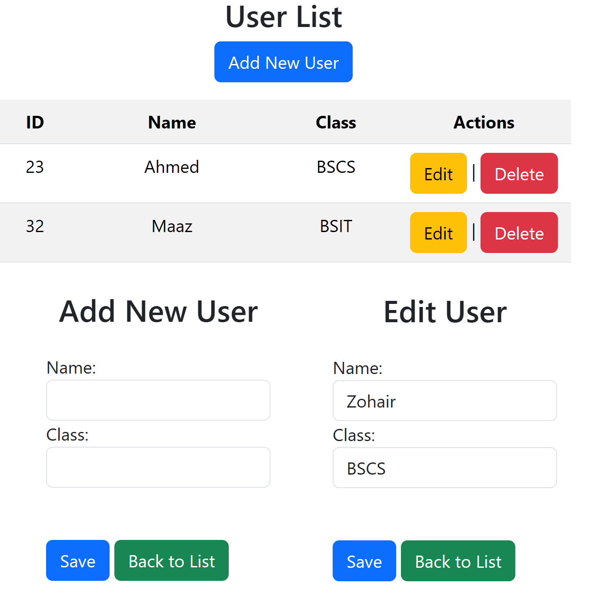

# JSP Servlet JDBC CRUD Tutorial

This is a simple JSP Servlet JDBC CRUD example with MySQL.  
It is designed as a complete beginner-friendly tutorial project to help you learn how to build a Java web application using Servlets, JSP, and direct JDBC calls without any frameworks.



## Features

- Connects to MySQL database using JDBC  
- Perform Create, Read, Update, Delete operations on a users table  
- Uses Servlet to handle HTTP GET and POST requests  
- JSP pages for displaying and submitting data  
- Bootstrap for clean and responsive UI  
- No DAO pattern — all database logic is inside the Servlet for easy understanding

## Getting Started

### Prerequisites

- Java JDK  
- Apache Tomcat or any Servlet container  
- MySQL server with a database and users table  
- MySQL JDBC Driver (Connector/J) added to your project’s classpath

### Database Setup

Run the following SQL commands in your MySQL to create the database and table:

```sql
CREATE DATABASE IF NOT EXISTS testdb;
USE testdb;

CREATE TABLE users (
  id INT AUTO_INCREMENT PRIMARY KEY,
  name VARCHAR(100),
  email VARCHAR(100)
);
